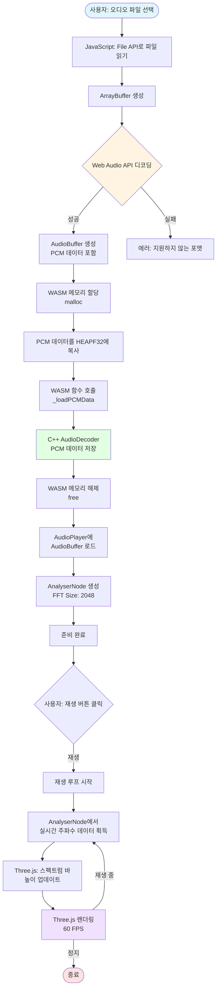
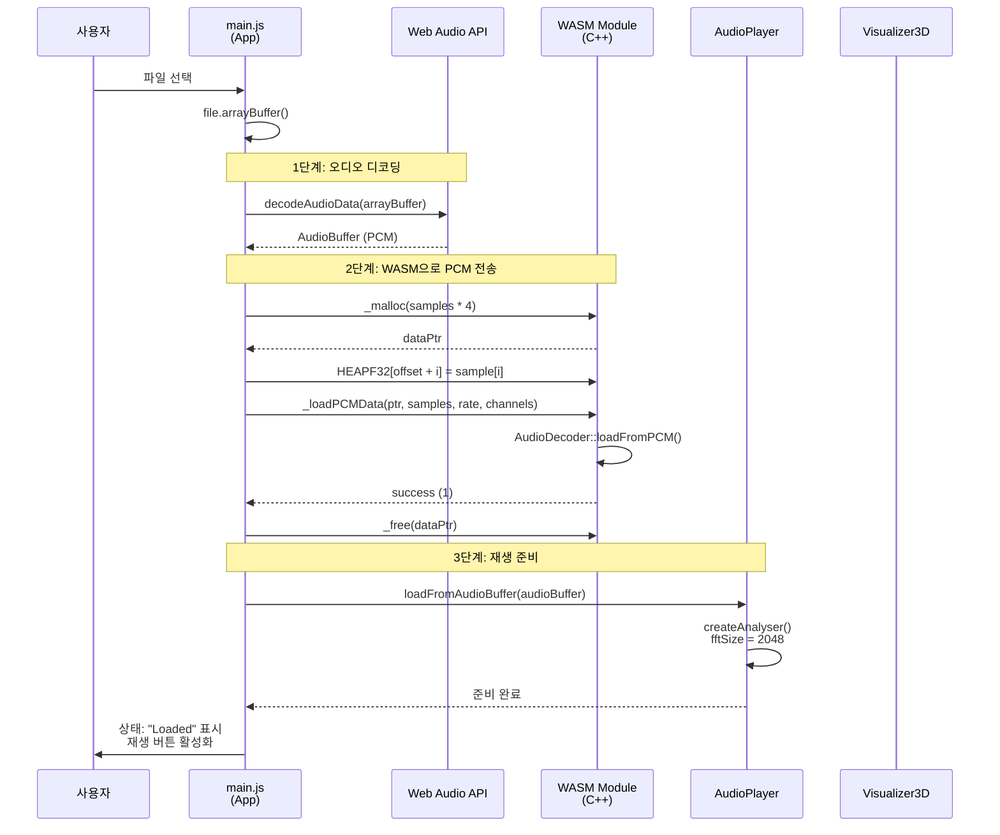
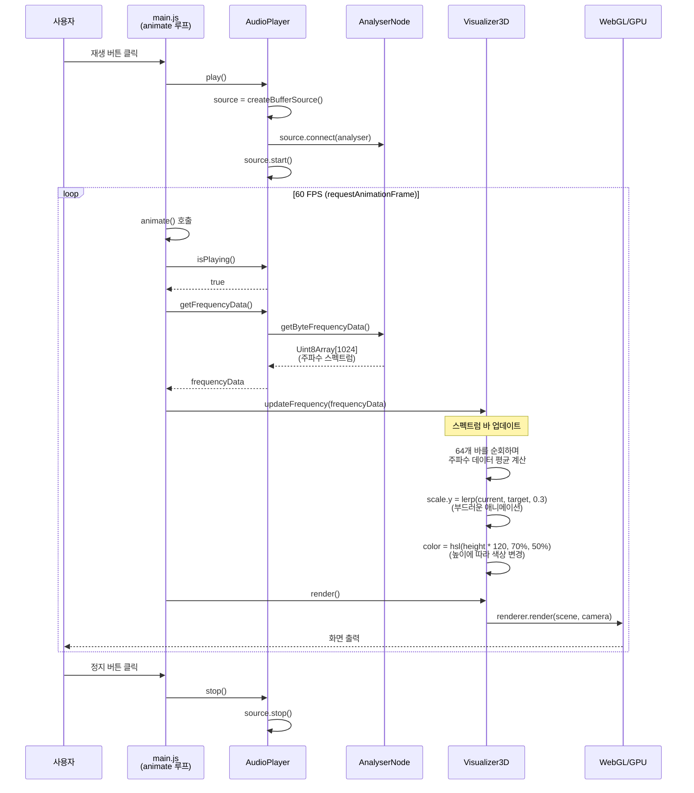
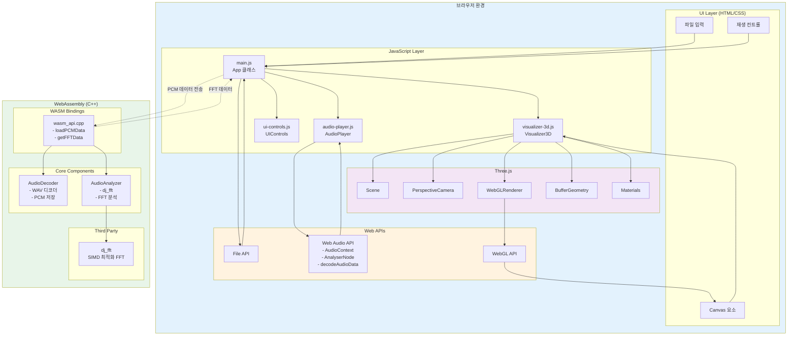
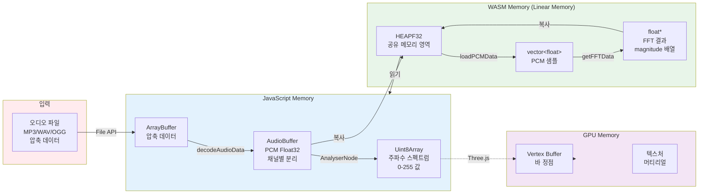
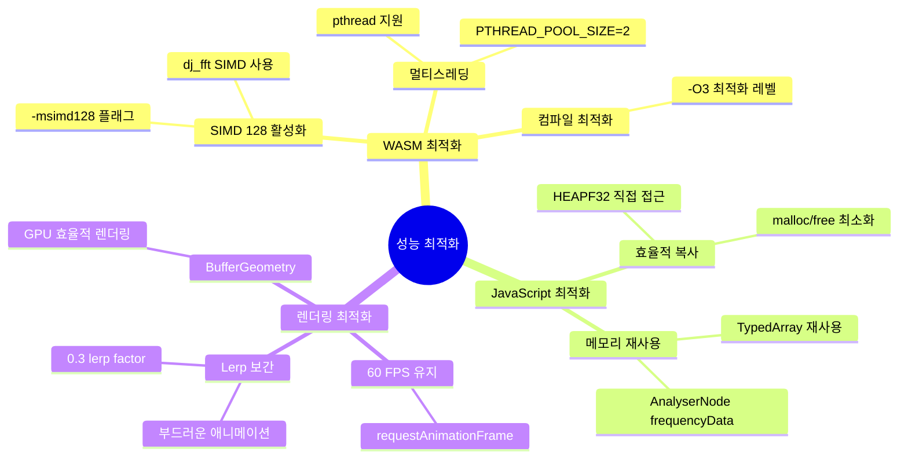
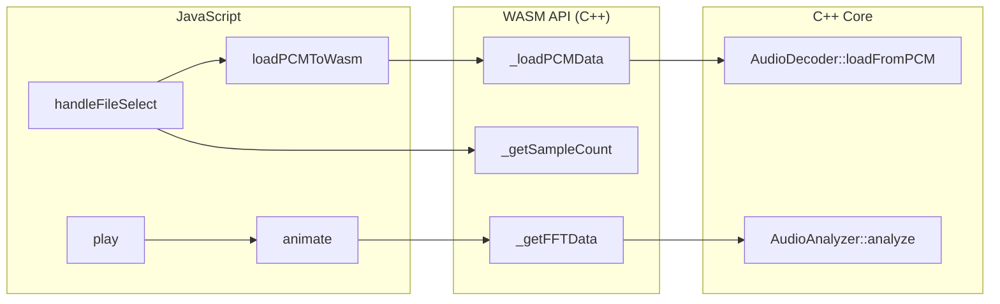

# WASM Audio Visualizer - Architecture Documentation

## 시스템 개요

이 프로젝트는 Web Audio API, WebAssembly(C++), Three.js를 조합하여 오디오 파일을 실시간으로 3D 시각화하는 시스템입니다.

---

## 1. 전체 시스템 플로우



---

## 2. 파일 로드 시퀀스



---

## 3. 실시간 재생 & 시각화 루프



---

## 4. 컴포넌트 아키텍처



---

## 5. 데이터 플로우 (메모리 관점)



---

## 6. 주요 기술 스택별 역할

| 기술 | 역할 | 주요 기능 |
|------|------|-----------|
| **Web Audio API** | 오디오 디코딩 & 분석 | - decodeAudioData: 모든 포맷 디코딩<br/>- AnalyserNode: 실시간 FFT<br/>- AudioContext: 오디오 재생 |
| **WebAssembly (C++)** | 고성능 오디오 처리 | - PCM 데이터 저장<br/>- dj_fft를 이용한 FFT 분석 |
| **Three.js** | 3D 시각화 | - 64개 스펙트럼 바 (원형 배치)<br/>- OrbitControls로 카메라 제어 |
| **dj_fft** | SIMD 최적화 FFT | - WebAssembly SIMD 128 사용<br/>- 고속 주파수 분석 |
| **Emscripten** | C++ → WASM 컴파일 | - pthread 지원 (멀티스레드)<br/>- ES6 모듈 생성<br/>- 메모리 관리 (malloc/free) |

---

## 7. 성능 최적화 포인트



---

## 8. 에러 처리 플로우


---

## 9. 파일 구조

```
wasm-audio-visualizer/
├── src/
│   ├── cpp/                    # C++ WASM 소스
│   │   ├── core/               # 핵심 오디오 처리
│   │   │   ├── audio_decoder.cpp      # PCM/WAV 디코더
│   │   │   ├── audio_analyzer.cpp     # FFT 분석 (dj_fft)
│   │   │   └── audio_buffer.cpp       # 오디오 버퍼 관리
│   │   ├── bindings/           # JavaScript ↔ C++ 바인딩
│   │   │   └── wasm_api.cpp    # EMSCRIPTEN_KEEPALIVE 함수들
│   │   └── third_party/
│   │       └── dj_fft/         # SIMD 최적화 FFT 라이브러리
│   └── web/                    # JavaScript 프론트엔드
│       ├── js/
│       │   ├── main.js         # 메인 앱 로직
│       │   ├── audio-player.js # Web Audio API 래퍼
│       │   ├── visualizer-3d.js # Three.js 시각화
│       │   └── ui-controls.js  # UI 컨트롤러
│       └── css/
│           └── style.css
├── public/                     # 빌드 출력 & 정적 파일
│   ├── audio-visualizer.wasm   # 컴파일된 WASM 바이너리
│   ├── audio-visualizer.js     # Emscripten 생성 JS 래퍼
│   └── *.mp3, *.wav            # 샘플 오디오
├── build/                      # CMake 빌드 디렉토리
├── CMakeLists.txt             # CMake 빌드 설정
├── index.html                 # 메인 HTML
└── server.js                  # 개발 서버
```

---

## 10. 주요 함수 호출 관계



---

## 빌드 및 실행

### 빌드 명령어
```bash
# Emscripten 환경 활성화
source ~/Projects/emsdk/emsdk_env.sh

# CMake 설정 및 빌드
mkdir build && cd build
emcmake cmake ..
emmake make
emmake make install

# 개발 서버 실행
cd ..
node server.js
```

### 브라우저 접속
```
http://localhost:8000
```

---

## 참고 자료

- [Emscripten Documentation](https://emscripten.org/docs/)
- [Web Audio API](https://developer.mozilla.org/en-US/docs/Web/API/Web_Audio_API)
- [Three.js Documentation](https://threejs.org/docs/)
- [dj_fft GitHub](https://github.com/jdupuy/dj_fft)
