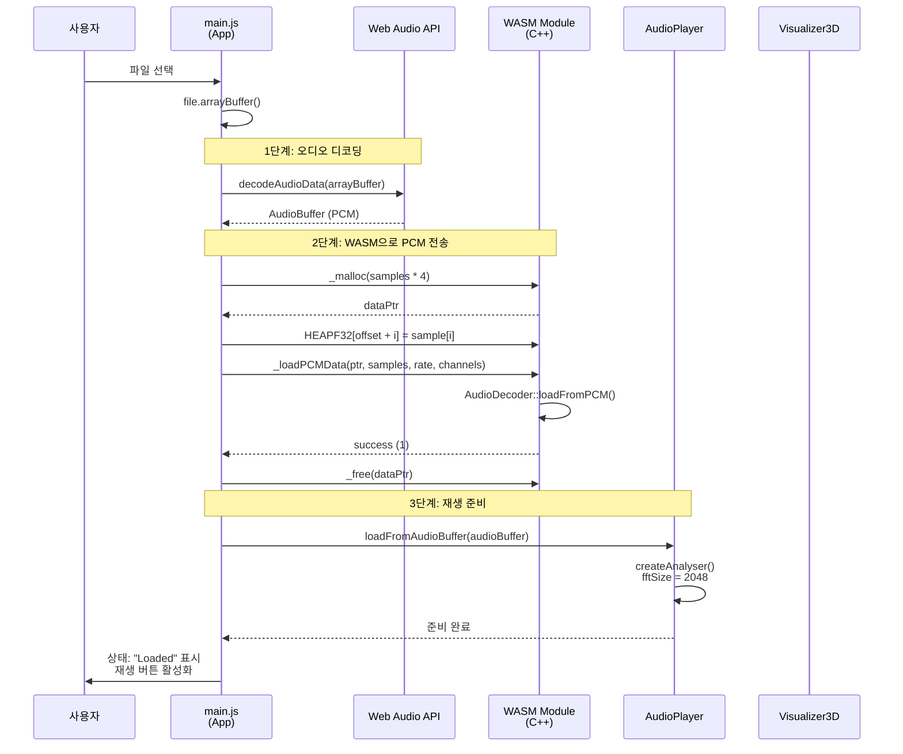
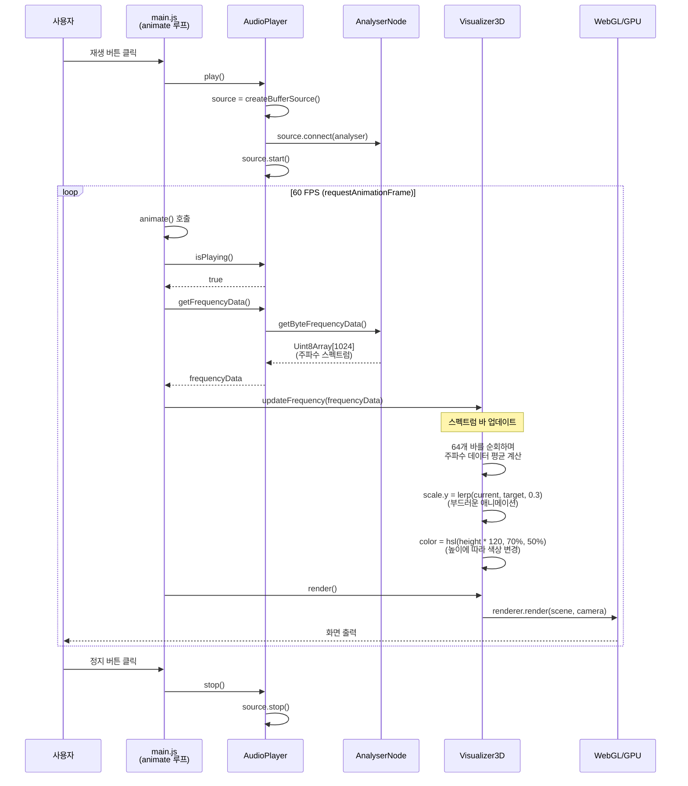
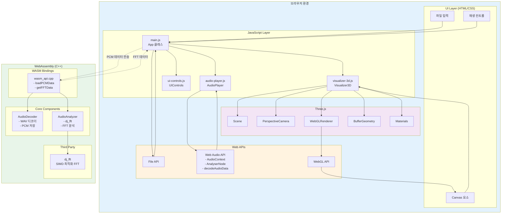
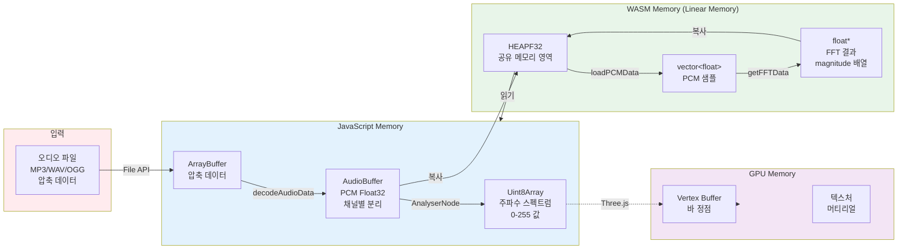
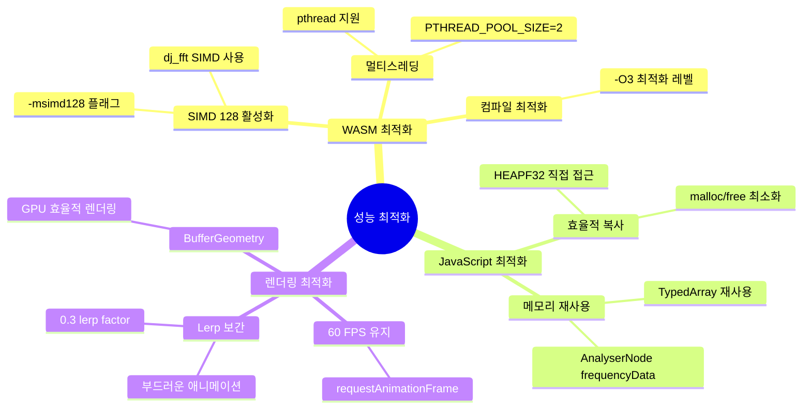
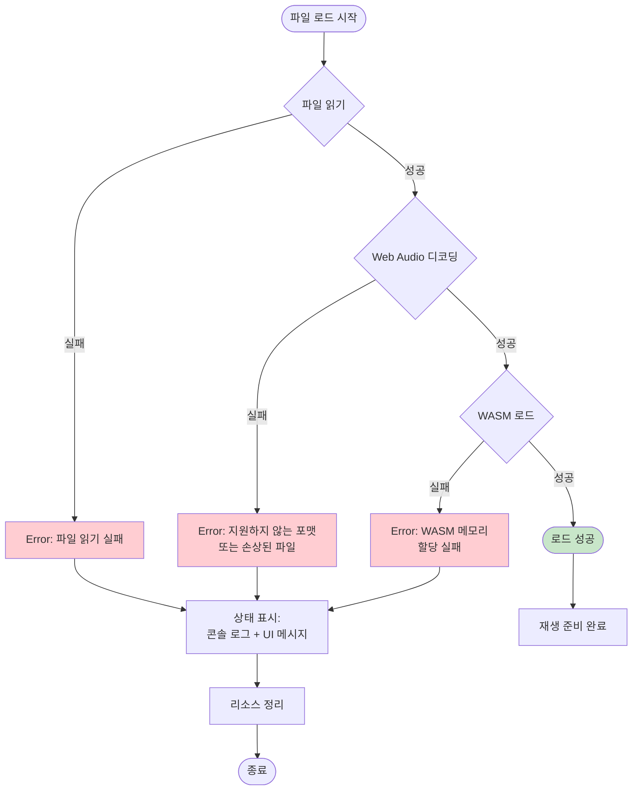
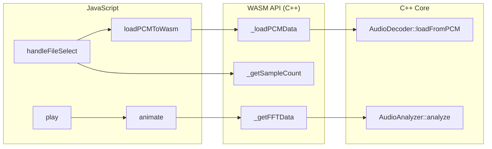
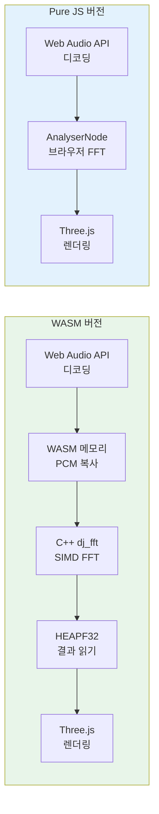

# WASM Audio Visualizer - Architecture Documentation

## 시스템 개요

이 프로젝트는 **WASM vs Pure JavaScript 성능 비교**를 위한 두 가지 버전의 오디오 시각화 시스템입니다:

1. **WASM 버전**: C++ dj_fft (SIMD 최적화)를 사용한 고성능 FFT
2. **Pure JavaScript 버전**: Web Audio API의 AnalyserNode를 사용한 브라우저 네이티브 FFT

두 버전 모두 Web Audio API, Three.js를 사용하여 오디오 파일을 실시간으로 3D 시각화하며, 성능 메트릭을 실시간으로 측정합니다.

---

## 1. 전체 시스템 플로우


---

## 2. 파일 로드 시퀀스



---

## 3. 실시간 재생 & 시각화 루프



---

## 4. 컴포넌트 아키텍처



---

## 5. 데이터 플로우 (메모리 관점)



---

## 6. 주요 기술 스택별 역할

| 기술 | 역할 | 주요 기능 |
|------|------|-----------|
| **Web Audio API** | 오디오 디코딩 & 분석 | - decodeAudioData: 모든 포맷 디코딩<br/>- AnalyserNode: 실시간 FFT<br/>- AudioContext: 오디오 재생 |
| **WebAssembly (C++)** | 고성능 오디오 처리 | - PCM 데이터 저장<br/>- dj_fft를 이용한 FFT 분석 |
| **Three.js** | 3D 시각화 | - 64개 스펙트럼 바 (원형 배치)<br/>- OrbitControls로 카메라 제어 |
| **dj_fft** | SIMD 최적화 FFT | - WebAssembly SIMD 128 사용<br/>- 고속 주파수 분석 |
| **Emscripten** | C++ → WASM 컴파일 | - pthread 지원 (멀티스레드)<br/>- ES6 모듈 생성<br/>- 메모리 관리 (malloc/free) |

---

## 7. 성능 최적화 포인트



---

## 8. 에러 처리 플로우



---

## 9. 파일 구조

```
wasm-audio-visualizer/
├── src/
│   ├── cpp/                    # C++ WASM 소스
│   │   ├── core/               # 핵심 오디오 처리
│   │   │   ├── audio_decoder.cpp      # PCM/WAV 디코더
│   │   │   ├── audio_analyzer.cpp     # FFT 분석 (dj_fft)
│   │   │   └── audio_buffer.cpp       # 오디오 버퍼 관리
│   │   ├── bindings/           # JavaScript ↔ C++ 바인딩
│   │   │   └── wasm_api.cpp    # EMSCRIPTEN_KEEPALIVE 함수들
│   │   └── third_party/
│   │       └── dj_fft/         # SIMD 최적화 FFT 라이브러리
│   └── web/                    # JavaScript 프론트엔드
│       ├── js/
│       │   ├── main.js         # 메인 앱 로직
│       │   ├── audio-player.js # Web Audio API 래퍼
│       │   ├── visualizer-3d.js # Three.js 시각화
│       │   └── ui-controls.js  # UI 컨트롤러
│       └── css/
│           └── style.css
├── public/                     # 빌드 출력 & 정적 파일
│   ├── audio-visualizer.wasm   # 컴파일된 WASM 바이너리
│   ├── audio-visualizer.js     # Emscripten 생성 JS 래퍼
│   └── *.mp3, *.wav            # 샘플 오디오
├── build/                      # CMake 빌드 디렉토리
├── CMakeLists.txt             # CMake 빌드 설정
├── index.html                 # 메인 HTML
└── server.js                  # 개발 서버
```

---

## 10. 주요 함수 호출 관계



---

## 빌드 및 실행

### 빌드 명령어
```bash
# Emscripten 환경 활성화
source ~/Projects/emsdk/emsdk_env.sh

# CMake 설정 및 빌드
mkdir build && cd build
emcmake cmake ..
emmake make
emmake make install

# 개발 서버 실행
cd ..
node server.js
```

### 브라우저 접속
```
http://localhost:8000
```

---

---

## 11. WASM vs Pure JavaScript 비교

### 11.1 두 가지 구현 버전

#### WASM 버전 (`index.html`)
- **FFT 엔진**: C++ dj_fft (SIMD 128 최적화)
- **파일**: `main.js` + `audio-visualizer.wasm`
- **장점**: SIMD 최적화, 커스텀 알고리즘 구현 가능
- **단점**: WASM 로딩 시간 (~500ms), 복잡한 구조

#### Pure JavaScript 버전 (`pure-js.html`)
- **FFT 엔진**: Web Audio API의 `AnalyserNode`
- **파일**: `pure-js-main.js` (WASM 없음)
- **장점**: 빠른 초기 로딩, 간단한 구조, 브라우저 최적화
- **단점**: 브라우저 FFT에 의존, 커스터마이징 제한

### 11.2 아키텍처 비교



### 11.3 성능 측정 시스템

#### PerformanceMonitor 클래스

양쪽 버전 모두 동일한 성능 측정 도구 사용:

```javascript
// src/web/js/performance-monitor.js

class PerformanceMonitor {
    // FPS 측정
    beginFrame() { /* ... */ }
    endFrame() { /* ... */ }

    // FFT 시간 측정
    beginFFT() { /* ... */ }
    endFFT() { /* ... */ }

    // 메모리 측정
    checkMemory() { /* performance.memory */ }

    // UI 업데이트
    updateUI() { /* 실시간 표시 */ }
}
```

#### 측정 지표

| 지표 | 설명 | 목표값 |
|------|------|--------|
| **FPS** | 초당 프레임 수 | 60 |
| **Frame Time** | 프레임 처리 시간 | < 16.67ms |
| **FFT Time** | FFT 계산 시간 | 비교 대상 |
| **Memory** | JS 힙 메모리 | 낮을수록 좋음 |

### 11.4 성능 비교 예상 결과

#### 초기 로딩 시간
- **Pure JS**: ~100ms (HTML + JS 로딩만)
- **WASM**: ~600ms (HTML + JS + WASM 모듈 로딩)

#### FFT 계산 시간 (2048 FFT 기준)
- **Pure JS (AnalyserNode)**: ~0.1-0.3ms (브라우저 최적화)
- **WASM (dj_fft)**: ~0.2-0.5ms (SIMD 최적화)

*실제 결과는 브라우저, CPU, FFT 크기에 따라 다름*

#### 메모리 사용량
- **Pure JS**: ~20-30 MB (JS 힙만)
- **WASM**: ~30-40 MB (JS 힙 + WASM 선형 메모리)

### 11.5 코드 구조 비교

```
공통 컴포넌트 (재사용):
├── audio-player.js        # Web Audio API 래퍼
├── visualizer-3d.js       # Three.js 시각화
├── ui-controls.js         # UI 컨트롤
└── performance-monitor.js # 성능 측정

WASM 버전 전용:
├── main.js                # WASM 모듈 로딩 및 통합
├── wasm_api.cpp           # C++ 바인딩
├── audio_analyzer.cpp     # dj_fft 사용
└── audio-visualizer.wasm  # 컴파일된 모듈

Pure JS 버전 전용:
└── pure-js-main.js        # WASM 없는 구현
```

### 11.6 사용 사례별 권장사항

#### WASM 버전을 사용해야 하는 경우:
- 커스텀 오디오 알고리즘 구현이 필요한 경우
- 매우 큰 FFT 크기 사용 (8192, 16384 등)
- 추가 DSP 처리가 필요한 경우
- WebAssembly 성능 벤치마킹

#### Pure JS 버전을 사용해야 하는 경우:
- 빠른 초기 로딩이 중요한 경우
- 간단한 스펙트럼 시각화만 필요한 경우
- WASM 빌드 환경 구축이 어려운 경우
- 브라우저 호환성 극대화

---

## 12. 성능 최적화 전략

### 12.1 WASM 버전 최적화

```cpp
// CMakeLists.txt 최적화 플래그
-O3                    # 최대 최적화
-msimd128              # SIMD 128 활성화
-s ALLOW_MEMORY_GROWTH # 동적 메모리 증가
```

**dj_fft 최적화**:
- Hann 윈도우 사전 계산
- SIMD intrinsics 활용
- 불필요한 복사 최소화

### 12.2 Pure JS 버전 최적화

```javascript
// AnalyserNode 설정 최적화
analyser.fftSize = 2048;           // 2의 거듭제곱
analyser.smoothingTimeConstant = 0; // 스무딩 비활성화 (raw 데이터)

// TypedArray 재사용
this.frequencyData = new Uint8Array(analyser.frequencyBinCount);
// 매 프레임마다 새로 생성하지 않음
```

### 12.3 공통 최적화

**Three.js 렌더링**:
- BufferGeometry 사용 (일반 Geometry보다 빠름)
- Lerp 보간으로 부드러운 애니메이션 (0.3 factor)
- 불필요한 재렌더링 방지

**requestAnimationFrame**:
- 60 FPS 목표
- 조건부 렌더링 (재생 중일 때만 FFT 계산)

---

## 13. 디버깅 및 프로파일링

### 13.1 성능 프로파일링

**Chrome DevTools 사용**:
1. F12 → Performance 탭
2. 녹화 시작
3. 오디오 재생
4. 녹화 중지 후 분석

**주요 확인 사항**:
- `animate()` 함수 실행 시간
- FFT 계산 시간 (WASM vs Pure JS)
- Three.js 렌더링 시간
- 가비지 컬렉션 빈도

### 13.2 메모리 프로파일링

```javascript
// 콘솔에서 메모리 확인
if (performance.memory) {
    console.log({
        usedJSHeapSize: (performance.memory.usedJSHeapSize / 1048576).toFixed(2) + ' MB',
        totalJSHeapSize: (performance.memory.totalJSHeapSize / 1048576).toFixed(2) + ' MB',
        jsHeapSizeLimit: (performance.memory.jsHeapSizeLimit / 1048576).toFixed(2) + ' MB'
    });
}
```

### 13.3 WASM 디버깅

**Source Maps 활성화**:
```cmake
"-gsource-map"
"--source-map-base=http://localhost:8000/"
```

**Chrome DevTools에서 C++ 디버깅**:
- Sources 탭에서 `.cpp` 파일 확인
- 브레이크포인트 설정 가능
- 변수 값 확인

---

## 참고 자료

### 공식 문서
- [Emscripten Documentation](https://emscripten.org/docs/)
- [Web Audio API](https://developer.mozilla.org/en-US/docs/Web/API/Web_Audio_API)
- [Three.js Documentation](https://threejs.org/docs/)
- [dj_fft GitHub](https://github.com/jdupuy/dj_fft)

### 성능 관련
- [Chrome Performance Profiling](https://developer.chrome.com/docs/devtools/performance/)
- [WebAssembly Performance](https://web.dev/articles/webassembly-performance)
- [Web Audio API Performance Best Practices](https://developer.chrome.com/blog/web-audio-performance/)
